## Gerenciador de Biblioteca

Esse sistema foi criado para tornar mais fácil e organizado o trabalho de gerenciamento de uma biblioteca. Com ele, é possível cadastrar usuários (como alunos e professores), adicionar livros ao acervo, registrar empréstimos e devoluções, além de consultar ou remover informações sempre que necessário. Tudo foi desenvolvido em Python, utilizando a SQLAlchemy para lidar com o banco de dados, o Tabulate para exibir os dados em tabelas no terminal, e o SQLite como banco leve e prático para esse tipo de aplicação. É uma solução simples, funcional e ideal para pequenos ambientes acadêmicos.

 
## Instalação

### 1. Preparação do ambiente

Após clonar o repositório, vamos preparar as bibliotecas necessárias.  
É recomendado o uso de um ambiente virtual para manter as dependências isoladas. Caso prefira instalar diretamente no sistema, pode pular esta etapa.

### 2. Criar e ativar o ambiente virtual

No terminal do VS Code, execute o comando para criar o ambiente virtual:

```bash
python -m venv .venv
```

No Windows, a execução de scripts geralmente vem desabilitada por padrão, o que impede a ativação do ambiente virtual.  
Para liberar essa permissão, abra o PowerShell como administrador e execute:

```powershell
Set-ExecutionPolicy -ExecutionPolicy RemoteSigned -Scope CurrentUser
```

Confirme a alteração digitando `S` e pressionando Enter.

Depois, volte ao terminal do VS Code e ative o ambiente virtual com:

```powershell
.venv\Scripts\Activate.ps1
```

Se você estiver usando o Prompt de Comando (cmd), ative com:

```cmd
.venv\Scripts\activate.bat
```

Ao ativar corretamente, o prompt do terminal exibirá o nome do ambiente (ex: `(.venv)`).

### 3. Instalar as dependências

Com o ambiente virtual ativado, instale as bibliotecas necessárias usando:

```bash
pip install -r requirements.txt
```

### 4. Executar a aplicação

Com tudo configurado, execute o arquivo principal para rodar a aplicação:

```bash
python main.py
```

## Como usar

Abaixo estão imagens ilustrativas das principais funcionalidades do sistema, organizadas por cada menu disponível na aplicação.

---

### Menu Principal

O menu principal oferece acesso a todas as seções do sistema, permitindo o gerenciamento completo dos cadastros de livros, usuários e empréstimos.

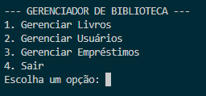

---

### Menu Livros

No menu de livros, é possível cadastrar novos títulos, consultar registros existentes e remover livros da base de dados.

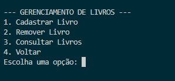

Ao escolher a opção de cadastro, o sistema solicitará as informações necessárias para registrar o livro.

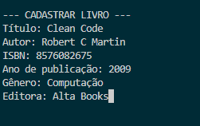

Na opção de remoção, é solicitado o ISBN do livro. O sistema impede a exclusão de livros que ainda estejam vinculados a empréstimos ativos.

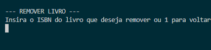

O menu de consultas permite visualizar todos os livros cadastrados ou filtrar por gênero e autor. O sistema solicitará os critérios de pesquisa ao selecionar uma dessas opções.


Após qualquer operação, o sistema exibirá no console uma mensagem com o resultado e retornará automaticamente ao menu anterior.

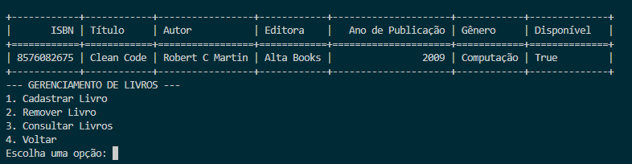

---

### Menu Usuários

Neste menu, é possível cadastrar novos usuários, consultar registros existentes e remover usuários do sistema.

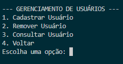

Durante o cadastro, o sistema solicitará informações como nome, tipo (aluno ou professor) e outros dados essenciais.

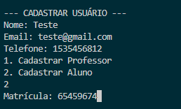

Para remover um usuário, é necessário informar seu ID. O sistema bloqueia a exclusão caso existam empréstimos ativos associados ao usuário.

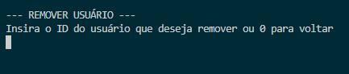

No menu de consultas, é possível visualizar todos os usuários cadastrados ou listar apenas aqueles com empréstimos em atraso.

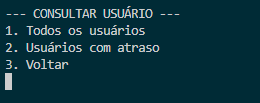

Após qualquer ação, uma mensagem será exibida no console com o resultado e o sistema retornará ao menu anterior.

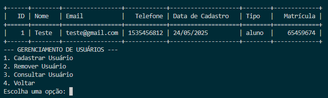

---

### Menu Empréstimos

O menu de empréstimos permite registrar novos empréstimos, realizar devoluções e consultar empréstimos ativos.

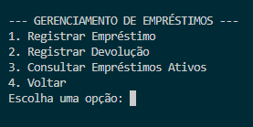

Ao registrar um novo empréstimo, o sistema solicitará os dados do livro e do usuário para completar o processo.

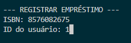

Para registrar uma devolução, basta informar o ISBN do livro e o ID do usuário. O sistema atualizará o status do livro para disponível e marcará o empréstimo como devolvido.

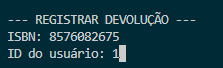

A opção de consulta exibe todos os empréstimos que ainda estão ativos, sem necessidade de filtros adicionais.

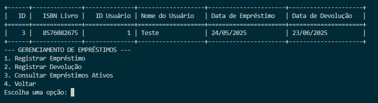


## Funcionalidades

- **Cadastro de Livros**  
  Permite registrar novos livros no sistema.

- **Remoção de Livros**  
  Possibilita remover livros cadastrados, desde que não estejam com empréstimos ativos.

- **Consulta de Livros**  
  Exibe todos os livros cadastrados ou permite filtrar por autor e gênero para facilitar a busca.

- **Cadastro de Usuários**  
  Registra novos usuários, com identificação como aluno ou professor.

- **Remoção de Usuários**  
  Permite excluir usuários do sistema, desde que não possuam empréstimos em aberto.

- **Consulta de Usuários**  
  Mostra todos os usuários cadastrados e também possibilita filtrar aqueles com empréstimos em atraso.

- **Registro de Empréstimos**  
  Permite registrar empréstimos de livros aos usuários, registrando as informações necessárias e atualizando o status do livro.

- **Registro de Devoluções**  
  Realiza a devolução de livros emprestados, marcando o empréstimo como devolvido e tornando o livro disponível novamente.

- **Consulta de Empréstimos Ativos**  
  Lista todos os empréstimos que ainda não foram devolvidos.

- **Validações de Segurança**  
  Impede ações incorretas, como a remoção de livros ou usuários com vínculos ativos.


## Estrutura do Projeto

### Estrutura de Pastas

O projeto segue o padrão arquitetural **MVC (Model-View-Controller)**, promovendo uma separação clara de responsabilidades:

- **Model**: Responsável pela estrutura dos dados e comunicação com o banco.
- **View**: Contém as funções que imprimem opções, tratam entradas e interagem com o usuário.
- **Controller**: Gerencia a lógica de negócio e o fluxo de dados entre Model e View.

#### Organização de Diretórios

```
GERENCIADORDEBIBLIOTECA/
├── controllers/         # Lógica de negócio da aplicação
├── docs/                # Arquivos de documentação
├── instance/            # Arquivo gerado do banco de dados SQLite
├── models/              # Modelos das tabelas do banco
├── view/                # Funções de interação com o usuário
├── .gitignore           # Arquivos ignorados pelo Git
├── main.py              # Arquivo principal da aplicação
├── README.md            # Documentação do projeto
└── requirements.txt     # Dependências do projeto
```

Essa estrutura facilita a manutenção, organização e a adaptabilidade do sistema para futuras expansões.


### Banco de Dados

O sistema de biblioteca é estruturado em torno de quatro tabelas principais: **Usuários**, **Livros**, **Empréstimos**, e as subclasses específicas de usuários (**Professores** e **Alunos**). Abaixo está uma descrição de cada uma delas e como se relacionam:

---

#### Diagrama

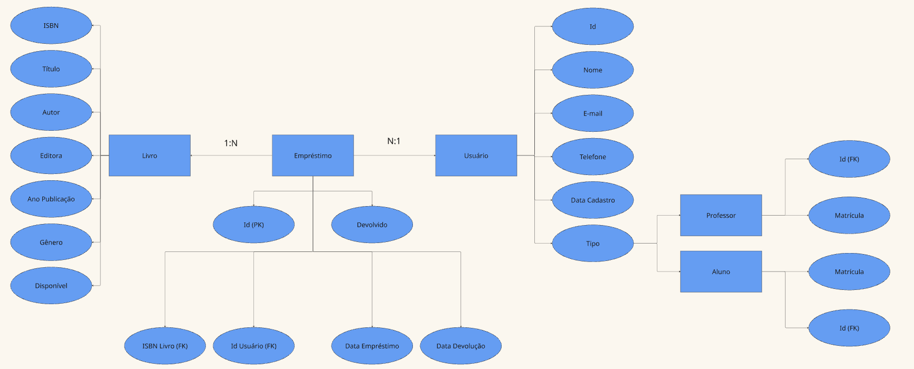

#### Usuários

A tabela `usuarios` armazena os dados básicos de todos os usuários do sistema, como:

- ID (chave primária)
- Nome  
- E-mail  
- Telefone  
- Data de cadastro  
- Tipo de usuário  

Os usuários são divididos em dois tipos principais: **professores** e **alunos**, que são modelados como subclasses usando herança (tabelas `professores` e `alunos`), cada uma com seu campo específico de matrícula.  

Essa modelagem permite que tanto professores quanto alunos sejam tratados como usuários no sistema, mas com atributos diferenciados.

---

#### Livros

A tabela `livros` contém os dados dos livros disponíveis na biblioteca, incluindo:

- ISBN (chave primária)  
- Título  
- Autor  
- Editora  
- Ano de publicação  
- Gênero  
- Campo booleano que indica se o livro está disponível para empréstimo  

Cada livro pode estar associado a múltiplos empréstimos ao longo do tempo, mas um empréstimo específico se refere a apenas um livro.

---

#### Empréstimos

A tabela `emprestimos` registra os empréstimos dos livros para os usuários, com os seguintes campos:

- ID do empréstimo  
- ISBN do livro emprestado  
- ID do usuário que pegou o livro  
- Data do empréstimo  
- Data prevista para devolução  
- Campo booleano que indica se o livro foi devolvido  

Os relacionamentos entre empréstimos, usuários e livros permitem que o sistema rastreie quem está com qual livro e o status de cada empréstimo.

---

#### Relacionamentos principais

- Cada usuário pode ter **zero ou mais empréstimos registrados** (relação um-para-muitos), permitindo que o sistema acompanhe o histórico de empréstimos de cada usuário.

- Cada livro pode estar associado a **múltiplos empréstimos**, porém cada empréstimo está relacionado a um **único livro** específico.

- As tabelas `professores` e `alunos` estendem a tabela `usuarios`, diferenciando os tipos de usuários e armazenando informações específicas, como matrícula.


## Bibliotecas Usadas

### SQLAlchemy  
Biblioteca que simplifica a interação com bancos de dados relacionais, permitindo definir modelos de dados em Python e realizar operações no banco de forma organizada, eficiente e segura.

### Tabulate  
Biblioteca que facilita a exibição de dados em formato de tabelas no console, melhorando a visualização e compreensão das informações retornadas pelas consultas ao banco de dados.
